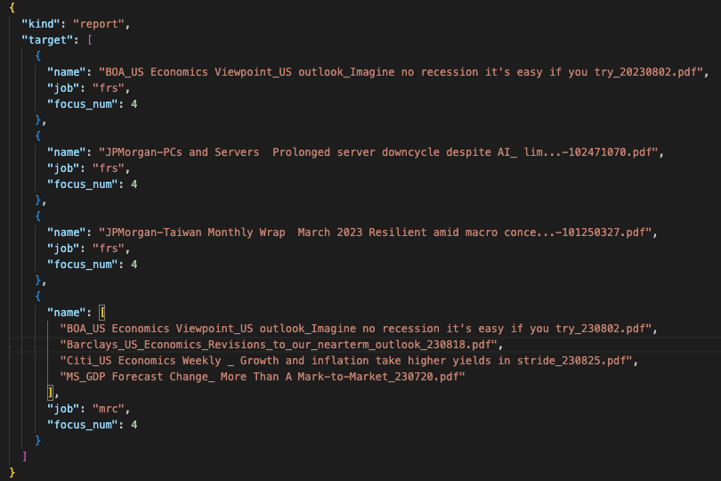
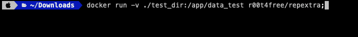

# Demo Page for Report Extractor

This is a demo page repository for Report Extractor.

## Usages

- To use GitHub Pages to generate target HTML pages for visualization.

## How To Use

This is a brief guide for new users to execute the packaged functions.

### By Docker

1. Create a folder and put target PDFs into it.
2. Create `config.json` to determine your jobs and PDFs.

   - `name`, `job` and `focus_num` are essential keys you should define.
   - Currently, we only support `frs` and `mrc` for `job` key.

   

3. Run the following command.
   
   > You have to replace `./test_dir` by your own folder path.

## TODOs

### Images

- Captions
  - 2 or multi-line included
  - Note in Source bbox
- Image size
  - Should we expand the image?

### Tables

- Recognition
  - How to recognize tables w.o. headers?

### Texts

- Header
  - new line w.r.t. the paragraph text block
